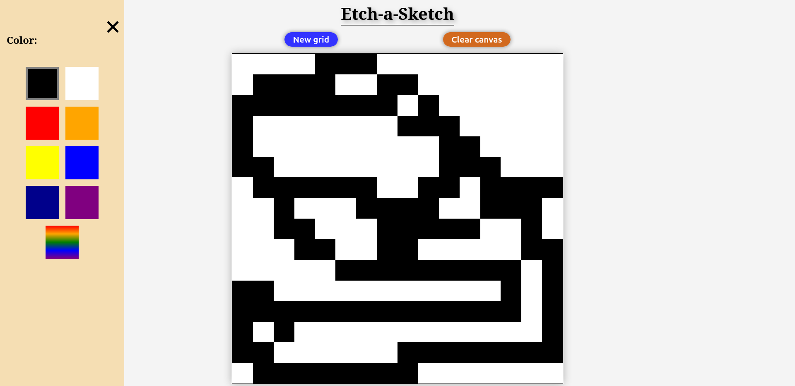
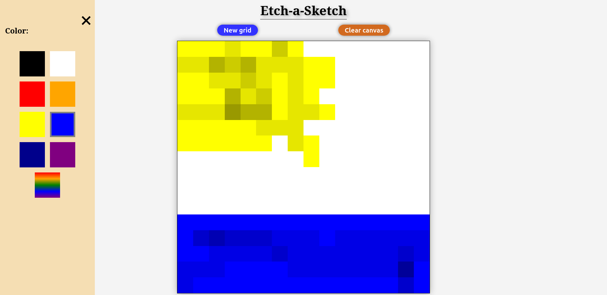
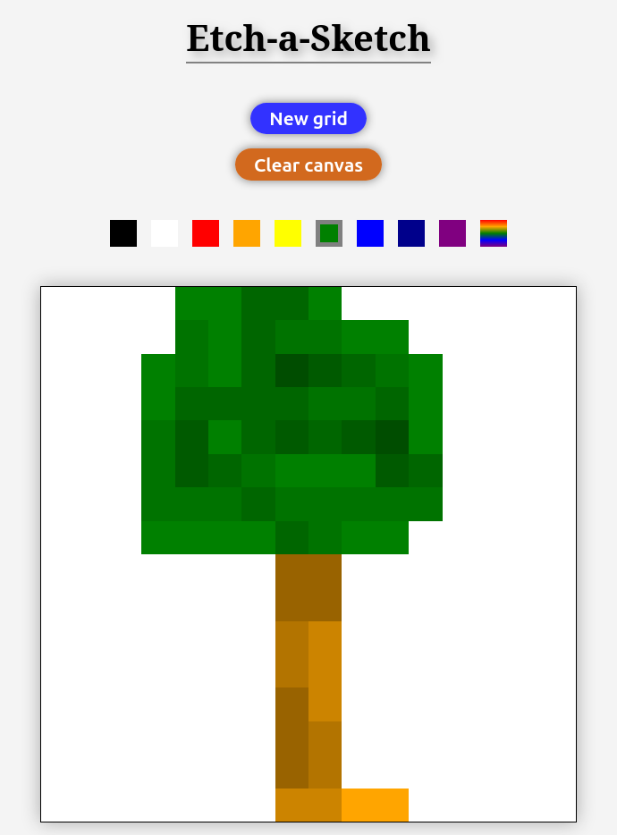

# Etch-a-Sketch

This repository provides the solution for the project [Etch-a-Sketch](https://www.theodinproject.com/lessons/foundations-etch-a-sketch) from The Odin Project.

You can view the app by clicking [here](https://stilettodagger.github.io/etch-a-sketch/)

## Overview

A web-based drawing application inspired by the classic Etch A Sketch toy. The app allows you to create pixel art with customizable grid sizes, selecting different colors including randomly generated colors with each pixel interaction. The app is also designed responsively so that it works on many screen sizes.

## Features

+ **Customizable Grid Sizes**: Choose your preferred grid size for your canvas. (*This feature essentially allows you to adjust the resolution of your image in order to control the level of detail in your drawing.*)
+ **Multiple Color Options**: Select from a palette of different colors and make your sketches as vibrant as you would like them to be. *You could also make pixels darker the more you interact with them using the same color*.
+ **Random Color Mode**: In this mode, you could fill your sketch with randomly generated color pixels, *and perhaps end up creating an accidental great work of abstract art*.
+ **Responsive UI Design**: The user interface has been designed with different screen sizes in mind. *Enjoy making sketches no matter which device you want to use*.

## Screenshots

<em>Sketch preview with color selection menu</em>

<em>Sketch preview with multiple colors</em>

    
    
<em>Sketch preview on a device with a smaller screen</em>

### Credits

As always, huge thanks to [The Odin Project](https://www.theodinproject.com/) for this project idea and for giving me the opportunity to learn for free!
